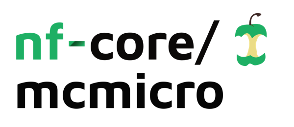
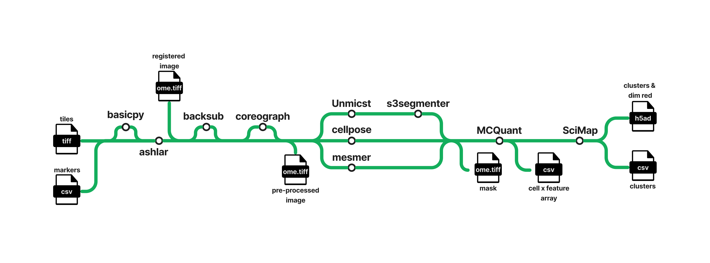

<h1>
  <picture>
    <source media="(prefers-color-scheme: dark)" srcset="docs/images/nf-core-mcmicro_logo_dark.png">
    
  </picture>
</h1>

[](https://github.com/nf-core/mcmicro/actions/workflows/ci.yml)
[](https://github.com/nf-core/mcmicro/actions/workflows/linting.yml)[](https://nf-co.re/mcmicro/results)[](https://doi.org/10.5281/zenodo.XXXXXXX)
[](https://www.nf-test.com)

[](https://www.nextflow.io/)
[](https://docs.conda.io/en/latest/)
[](https://www.docker.com/)
[](https://sylabs.io/docs/)
[](https://cloud.seqera.io/launch?pipeline=https://github.com/nf-core/mcmicro)

[](https://nfcore.slack.com/channels/mcmicro)[](https://twitter.com/nf_core)[](https://mstdn.science/@nf_core)[](https://www.youtube.com/c/nf-core)

## Introduction

> [!WARNING]
> We are currently in the process of porting the original MCMICRO to nf-core. This pipeline is therefore in active development.

**nf-core/mcmicro** is a nextflow pipeline for processing highly-multiplexed imaging data, as produced by technologies such as Cycif, MIBI, CODEX, SeqIF among others.

If you want to run the original MCMICRO pipeline outside of nf-core, please see <https://mcmicro.org/>.

The nf-core/mcmicro pipeline is an end-to-end processing pipeline that transforms multi-channel whole-slide images into single-cell data.  It takes samplesheet and markersheet files as input and perfoms registration, segmentation and quantification.  Multiple segmentation modules are available and can be run in parallel.  The pipeline can also optionally perform background and shading correction, background subtraction, and supports TMI cores.  It returns a pre-segmentation image file, a segmentation mask image, and a cell x feature array spreadsheet.



The MC in MCMICRO stands for 'Multiple Choice' and that refers to the fact that there will be multiple module options available for each step in the pipeline.  The currently supported options are provided in parentheses.
1. Registration ([Ashlar](https://nf-co.re/modules/ashlar/))
2. Segmentation ([Cellpose](https://nf-co.re/modules/cellpose/), [Mesmer](https://nf-co.re/modules/deepcell_mesmer/))
3. Quantification ([MCQuant](https://nf-co.re/modules/mcquant/))

## Usage

> [!NOTE]
> If you are new to Nextflow and nf-core, please refer to [this page](https://nf-co.re/docs/usage/installation) on how to set-up Nextflow. Make sure to [test your setup](https://nf-co.re/docs/usage/introduction#how-to-run-a-pipeline) with `-profile test` before running the workflow on actual data.

First, prepare a samplesheet and markersheet with your input data that looks as follows:

`samplesheet.csv`:

```csv
sample,cycle_number,channel_count,image_tiles
TEST1,1,10,https://raw.githubusercontent.com/nf-core/test-datasets/modules/data/imaging/ome-tiff/cycif-tonsil-cycle1.ome.tif

```

Each row of the samplesheet represents a single cycle `ome.tiff` microscopy image file.  The first column `sample` is the sample identifier.  It can be repeated in multiple rows for samples with multiple cycles.  The second column `cycle_number` is a number corresponding to the cycle number of the image.  The third column `channel_count` is a count of the number of channels in the image.  The fourth column `image_tiles` is a path or URL to the input image file. 

 `markersheet.csv`:

 ```csv
channel_number,cycle_number,marker_name
21,1,DNA_6
22,1,ELANE
23,1,CD57
24,1,CD45
 ```

Each row of the markersheet represents a single channel in the associated sample image.  The first column `channel_number` is an identifier for the respective channel.  The second column `cycle_number` corresponds to the cycle number of the image and it must match the `cycle_number` in the supplied samplesheet. The third column `marker_name` is the name of the marker for the given channel and cycle.

> [!WARNING]
> Please provide pipeline parameters via the CLI or Nextflow `-params-file` option. Custom config files including those provided by the `-c` Nextflow option can be used to provide any configuration _**except for parameters**_;
> see [docs](https://nf-co.re/usage/configuration#custom-configuration-files).

Now, you can run the pipeline using:

```bash
nextflow run nf-core/mcmicro \
   -profile <docker/singularity/.../institute> \
   --input_cycle samplesheet.csv \
   --marker_sheet markers.csv \
   --outdir <OUTDIR>
```

For more details and further functionality, please refer to the [usage documentation](https://nf-co.re/mcmicro/usage) and the [parameter documentation](https://nf-co.re/mcmicro/parameters).

## Pipeline output

To see the results of an example test run with a full size dataset refer to the [results](https://nf-co.re/mcmicro/results) tab on the nf-core website pipeline page.
For more details about the output files and reports, please refer to the
[output documentation](https://nf-co.re/mcmicro/output).

## Credits

nf-core/mcmicro was written by Rob Young and Jeremy Muhlich from the Laboratory of Systems Pharmacology at The Harvard University Medical School.  It is based on the Multiple-choice microscopy pipeline (MCMICRO) which was also developed there. 

We thank the following people for their assistance in the development of this pipeline:
- [heylf](https://github.com/heylf)
- [Florian Wuennemann](https://github.com/FloWuenne)
- [Phil Ewels](https://github.com/ewels)
- [Adam Taylor](https://github.com/adamjtaylor)

## Contributions and Support

If you would like to contribute to this pipeline, please see the [contributing guidelines](.github/CONTRIBUTING.md).

For further information or help, don't hesitate to get in touch on the [Slack `#mcmicro` channel](https://nfcore.slack.com/channels/mcmicro) (you can join with [this invite](https://nf-co.re/join/slack)).

## Citations

<!-- TODO nf-core: Add citation for pipeline after first release. Uncomment lines below and update Zenodo doi and badge at the top of this file. -->
<!-- If you use nf-core/mcmicro for your analysis, please cite it using the following doi: [10.5281/zenodo.XXXXXX](https://doi.org/10.5281/zenodo.XXXXXX) -->

If you use nf-core/mcmicro for your analysis, please cite it using the following article: [Schapiro et al. 2022 Nat. Methods](https://www.nature.com/articles/s41592-021-01308-y)

An extensive list of references for the tools used by the pipeline can be found in the [`CITATIONS.md`](CITATIONS.md) file.

You can cite the `nf-core` publication as follows:

> **The nf-core framework for community-curated bioinformatics pipelines.**
>
> Philip Ewels, Alexander Peltzer, Sven Fillinger, Harshil Patel, Johannes Alneberg, Andreas Wilm, Maxime Ulysse Garcia, Paolo Di Tommaso & Sven Nahnsen.
>
> _Nat Biotechnol._ 2020 Feb 13. doi: [10.1038/s41587-020-0439-x](https://dx.doi.org/10.1038/s41587-020-0439-x).
